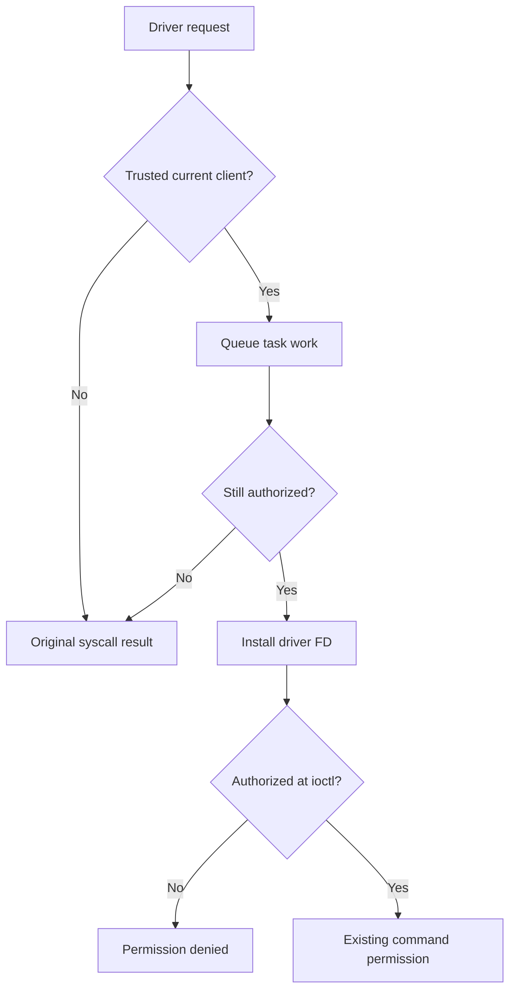

# R3 implementation plan (2026-10-10)

Approved by the user's instruction "do it fully" after the R3 research proposal.

## Baselines

KernelSU original v3.3.0: `932014ab5b2c9b74a3d11e2ec4d17dd10fc9442e`.
GhostLock: `3d4306c1abcf7b17a6e89ca5bc75721f873125c5`.
Working R2 packaging: `evilthatguy/evil@36766620a5c9011e52a92c2b28220669374da854`.
Target: NP03J, `6.1.145-android14-11-g11c274d0441f-ab14259673`, android14-6.1 LKM.

## Goals and constraints

Restrict driver installation and information requests to trusted clients, keep existing root-grant policy, remove GhostLock's automatic shell grant, backport selected manager and SELinux corrections, and sign with a persistent private key.
Preserve the stock kernel, bootloader state, root profiles and GhostLock wire/profile contracts. Build verification does not establish device stability or universal undetectability.

## File-level change list

- `kernel/manager/{apk_sign,throne_tracker,pkg_observer}.*`, `kernel/include/util.h`, `kernel/Kbuild`, `kernel/supercall/dispatch.c`: selected upstream discovery backports, pinned package and certificate.
- `kernel/supercall/{supercall,perm}.c`, `internal.h`: authorize before queueing, again before installation, and on each ioctl; preserve stock reboot result for rejected requests.
- `kernel/feature/selinux_hide.c`: upstream SID and permission-sequence backports; report enabled only after successful hook activation. Guard installed hooks while disabled. Retain the policy backup for the whole late-loaded session so an initially saved disabled choice can be enabled later; preserve early-boot cleanup.
- `kernel/selinux/{sepolicy,rules}.c`: upstream policy serialization buffer, avtab iteration/length and RCU access corrections required for a reliable policy backup and rule updates.
- `userspace/ksud/src/feature.rs`: default SELinux hiding on when unset, respecting explicit saved settings and module-managed features; check activation readback.
- Manager `ui/viewmodel/SettingsViewModel.kt`: refresh the actual SELinux hide state after toggling, and persist it only after successful activation.
- `userspace/ksud/src/sepolicy.rs`: scope the generated `derive-new` redundant-field-name lint; no parsing or policy behavior change.
- `ghost/src/core/attack/ops.cpp`: remove `--allow-shell`; check actual enforcing state at handoff. Existing resource ownership and exploit operations stay intact.
- `ghost/src/core/session/handoff_probe.{cpp,hpp}`, existing `handoff_probe_test.cpp`: require a confirmed enforcing read before reporting ready; a denied read must not count as confirmation.
- Existing R2 identity patch: R3 labels, coordinated package/JNI/native paths, unchanged identifiers for a one-time signing migration.
- R3 workflow/scripts: pinned sources/toolchains, host/native/Gradle checks, baseline disassembly comparison, public certificate only in CI, local final signing.

## Control flow

## Compatibility and rollback

R2's signing key was ephemeral and cannot be recovered. R3 needs one initial uninstall/reinstall of the two apps and a reboot to replace the transient module. Keep the complete R2 package as rollback. Never publish the R3 private key in the public repository or Actions artifacts.

## Validation matrix

- Pinned-source and patch application checks; package/profile/ABI invariants.
- Build the android14-6.1 LKM with the final public certificate, check ELF and embedded metadata.
- Android Rust check, clippy and formatting; manager release build.
- GhostLock native host tests, NDK build, clang-tidy, Kotlin unit tests.
- Record the unchanged original disassembly gate and compare eight instantiated critical GhostLock functions against the R2 source built with the identical compiler. The original catalog's two multicast worker names are absent in this revision; record their absence and additionally check `tcp_punch_thread` and `do_pselect_fake_lock_route`.
- Require all 21 unaffected native LLVM IR objects to remain byte-identical, permitting changes only in `ops`, `handoff_probe`, and its `root_child_frontend` caller. Review the original gate's one shape difference only if the relocated read-only eight-byte status constant is independently byte-identical; retain the raw failing report and the explicit reviewed result.
- Compare the reviewed native executable after the same strip operation with the executable actually packaged in GhostLock.
- Independently verify final APK v2 signatures/content digests, manifests, DEX/JNI boundaries, embedded LKM and public certificate.
- Device gate remains pending: cold boot, activation, manager/root apps, ordinary-client driver denial, SELinux Enforcing, saved feature state, repeated stability and detector results. Do not label this gate PASS without user logs.

## Explicitly preserved

W1/W2/W3, routes, timings, offsets, all kernel profiles, kernelsnitch, GLK1 wire, legacy conversion, manager root-grant checks, module name and `/proc/modules` handoff, `/data/adb` compatibility, attestation and firmware.

## Progress

- [x] Review sources and authorization.
- [x] Apply and review changes.
- [ ] Complete build verification.
- [ ] Deliver signed package, key backup, instructions and device-gate checklist.
